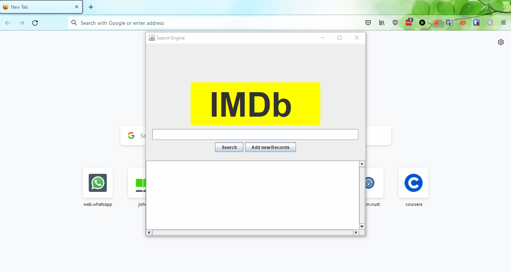
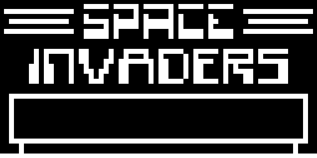
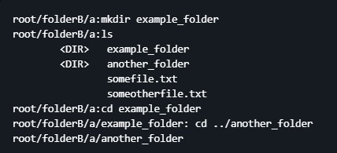

# Hi!

I'm a Software Engineer whose hobbies include video games and learning languages like Japanese and Arabic. I'm known to be very tenacious in learning and understanding new knowledge. I am also very methodical and prefer well documented, readable and maintainable code as a rule.

I'm highly interested in the use of Causal Inference for better decision making.

Currently a software engineer at APIMatic, using ***.NET***, ***TypeScript*** and ***Azure***. I've also been fortunate to get my hands dirty with Python, Ruby, Go and Java.

## Portfolio

A selection of the projects I've worked on:

### IMDb Movie Search Engine

[GitHub Repository](https://github.com/faraz455/Search-Engine-Project)

A search engine based on Google's seminal research paper, *"The Anatomy of a Large-Scale Hypertextual Web Search Engine"*. Written in Java.

### CHIP-8 Emulator

[GitHub Repository](https://github.com/EkuDS1/CHIP-8-Emulator)

A program that can run any program written in the CHIP-8 programming language with 8-bit graphics using OpenGL! A large variety of games and demos are available in the github repository. Written in Java.

### pyfs - A Python File System/File Server

[GitHub Repository](https://github.com/EkuDS1/pyfs)

This project was made to allow multiple users to access files and folders simultaneously on a single server. Written in Python.

## Contact

Feel free to reach out to me at **m.rafnadeem@gmail.com** for any queries or collaboration opportunities.

You can also find me on:
- [LinkedIn](https://www.linkedin.com/in/muhammad-rafay-nadeem-0726a7208)
- [GitHub](https://github.com/EkuDS1)
